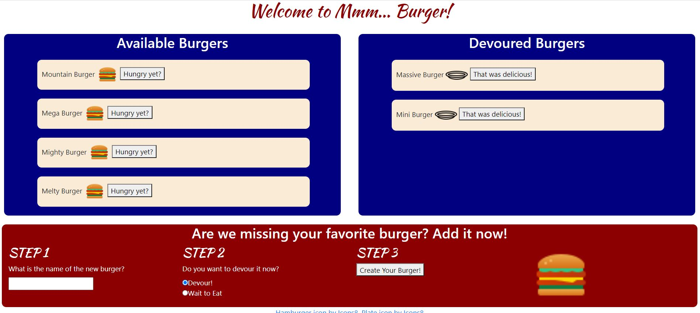

# Handlebars-Burgers

REVISION

I made some formatting changes (adding the icons, changing some fonts, and putting 'Step 1'... under the 'add burger' section).  

I also reviewed the Heroku setup and set an environmental variable to protect senstive information (like passwords) when deployed.

The Heroku link is https://mburgerapp.herokuapp.com/

                                  

ORIGINAL SUBMISSION

This was a very challenging assignment, but the instructions helped a lot to organize the structure.

Another thing that helped me, half-way through the project, was to diagram what each file did and how the files were connected.  I was even able to use that to explain the project outline to a classmate.

A classmate also mentioned that Activity #16 was very helpful.  I used that as a reference, but I tried as much as possible, especially in the beginning, to write sections from memory, filling in what was not exact.

For the MVC format,

M - Model
*    db folder 
*       schema.sql --- structure for database and table
*       seeds.sql --- initial data to populate the table
*    models
*       burger.js --- Call functions from orm and pass in arguments from database    

V - View
*    views
*       layouts
*            main.handlebars --- basic HTML framework
*       partials
*            burger-block.handlebars --- This had the HTML handling for buttons next to burger lists
*       index.handlebars --- This has the majority of the HTML handling

C - Controller
*    config 
*       connection.js --- connection to MySQL database
*       orm.js --- Call the connection and use it to create blank functions
*    controllers 
*       burgers-controllers.js --- build routes to HTML pages    
*    node modules --- to make Node work
*    package.json --- to make Node work
*    package-lock.json --- to make Node work
*    public
*       assets
*           css 
*               style.css --- css for display
*           img 
*               images to be loaded and linked
*           js
*               burgers.js --- controller for the buttons
*    server.js 
*       (within server.js code) --- Express (server connection to HTML)
*       (within server.js code) --- Handlebars --- connect to handlebars files to create HTML display
*       (within server.js code) --- routes --- connect to burgers-controllers.js for routes
